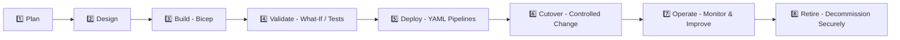

# 🔐 Azure Secure Environment Templates (Bicep + YAML)

[](./docs/SECURITY.md)
[](https://learn.microsoft.com/azure/azure-resource-manager/bicep/)
[](#-deployment-lifecycle)

> **Purpose:** Opinionated, security-first templates and runbooks to spin up new **Azure security environments** using **Bicep** for infrastructure and **YAML pipelines** for repeatable deployment.  
> All content is production-oriented but shipped with **no secrets, no IPs, and no tenant identifiers**.

---

## 🧭 Use Case

This repository is designed for scenarios where you need to stand up **repeatable, secure environments** in Azure, for example:

- Temporary **privileged access environments**
- Secure **remote access zones** for third parties
- Isolated **investigation / sandbox** environments with strong guardrails
- **Regional security landing zones** with consistent controls

Everything here is:
- **Idempotent** – safe to re-run for drift correction  
- **Redaction-safe** – all customer, tenant, and IP-specific details are removed  
- **Pipeline-ready** – YAML examples for GitHub Actions and Azure Pipelines

---

## 🧱 Repository Structure

```text
.
├─ README.md                    # You are here – overview, lifecycle, quickstart
├─ RUNBOOK.md                   # Operational runbook (day 0 / day 1 / day 2)
├─ .gitignore                   # Clean defaults for an infra-as-code repo
├─ bicep/
│  ├─ main.bicep                # Entry point for secure environment deployment
│  └─ modules/
│     ├─ network.bicep          # VNet + subnets layout for secure zones
│     ├─ security.bicep         # Network security, policies, guardrails
│     └─ monitoring.bicep       # Logging, metrics, diagnostic settings
├─ pipelines/
│  └─ azure-pipelines.yml       # Example Azure DevOps pipeline
├─ .github/
│  └─ workflows/
│     └─ deploy-environment.yml # Example GitHub Actions workflow
├─ scripts/
│  ├─ deploy-environment.ps1    # Wrapper for Bicep deployment
│  ├─ validate-deployment.ps1   # Pre-flight checks & what-if examples
│  ├─ remove-environment.ps1    # Tear-down for non-prod environments
│  ├─ pipeline-run-local.sh     # Local helper to mimic pipeline steps
│  └─ sample-parameters.json    # Redacted example parameter file
└─ docs/
   ├─ OVERVIEW.md               # High-level problem, scope, and personas
   ├─ ARCHITECTURE.md           # Logical & deployment architecture
   ├─ CUTOVER_CHECKLIST.md      # Go-live checklist for security environments
   ├─ ROLLBACK.md               # Rollback strategy & patterns
   └─ SECURITY.md               # Redaction statement & security posture
```

---

## 🔁 Deployment Lifecycle (End-to-End)



### 1️⃣ Plan
- Define **business context** and **security objectives**
- Identify **compliance requirements** (e.g. ISO, SOC, internal standards)
- Decide on **environment types** (e.g. `dev-sec`, `test-sec`, `prod-sec`)

### 2️⃣ Design
- Agree **landing zone pattern** and **network topology**
- Design **identity and access controls**
- Choose **observability and logging** boundaries

### 3️⃣ Build (Bicep)
- Author/reuse **Bicep modules** for:
  - Virtual networks & subnets
  - Network security rules and policies
  - Logging, metrics, diagnostics
- Keep everything **parameterised** (location, environment name, tags)

### 4️⃣ Validate
- Use `what-if` deployments to confirm expected changes
- Run static checks (e.g. `bicep build`, lints, policy checks)
- Confirm with **platform security** and **change management** teams

### 5️⃣ Deploy (YAML)
- Promote changes using **pipelines** (pull-request gated)
- Use **approvals & checks** before production deployments
- Separate **validation** and **deployment** stages

### 6️⃣ Cutover
- Follow the **CUTOVER_CHECKLIST.md**
- Communicate clearly with stakeholders
- Ensure **monitoring and logging** are healthy before declaring success

### 7️⃣ Operate
- Use **dashboards, alerts, and workbooks** for security & health
- Track drift and re-run Bicep for corrections
- Regularly review **access, logs and guardrails**

### 8️⃣ Retire
- Time-box temporary environments
- Decommission via **scripted teardown** (see `remove-environment.ps1`)
- Retain **logs & evidence** for the required retention period only

---

## 🚀 Quickstart

> These steps are deliberately generic – wire them into your own subscription, resource groups, and governance model.

### 1. Clone and review

```bash
git clone <your-repo-url>.git
cd <your-repo-folder>
```

Review:

- `bicep/main.bicep` – entry point for deployments
- `scripts/sample-parameters.json` – sample input structure
- `docs/SECURITY.md` – redaction & security conventions

### 2. Prepare your parameter file

Copy the example and customise **only in your private fork or branch**:

```bash
cp scripts/sample-parameters.json my-secure-env.parameters.json
```

Update values such as:

- `environmentName` (e.g. `"prod-sec"`)
- `location` (e.g. `"uksouth"`)
- Tags required by your organisation

⚠️ **Do not commit real subscription IDs, tenant IDs, IPs, or hostnames.** Use placeholders like `"${SUBSCRIPTION_ID}"` or `"example-vnet"` in committed files.

### 3. Run a validation deployment (what-if)

```powershell
# Example only – adapt to your conventions
./scripts/validate-deployment.ps1 `
  -EnvironmentName "dev-sec" `
  -Location "uksouth" `
  -TemplateFile "./bicep/main.bicep" `
  -ParameterFile "./scripts/sample-parameters.json"
```

Check the output and confirm expected changes with your platform/security team.

### 4. Deploy via script or pipeline

For a one-off deployment:

```powershell
./scripts/deploy-environment.ps1 `
  -EnvironmentName "dev-sec" `
  -Location "uksouth" `
  -TemplateFile "./bicep/main.bicep" `
  -ParameterFile "./scripts/sample-parameters.json"
```

For CI/CD, wire up either:

- `pipelines/azure-pipelines.yml` (Azure DevOps)
- `.github/workflows/deploy-environment.yml` (GitHub Actions)

Use your own service connections / federated credentials – **never hard-code secrets.**

---

## 🧪 Environments & Naming

A common pattern is:

| Environment | Example Name | Purpose                          |
|------------|--------------|----------------------------------|
| Dev        | `dev-sec`    | Experimentation & integration    |
| Test       | `test-sec`   | Pre-prod verification            |
| Prod       | `prod-sec`   | Live secure environment          |
| Sandbox    | `lab-sec`    | Short-lived investigation zones  |

You can control behaviour through parameters (e.g. stricter NSG rules or diagnostic settings in `prod-sec`).

---

## 🛡️ Redaction Badge & Security Statement

> **Redaction Badge**  
> This repository uses the following badge to indicate that it has been sanitised for public/portfolio use:
>
> [](./docs/SECURITY.md)

> **Security & Redaction Statement**
>
> - ✅ No real IP addresses  
> - ✅ No tenant IDs or subscription IDs  
> - ✅ No customer names or internal system identifiers  
> - ✅ No secrets (keys, passwords, certificates, connection strings)  
> - ✅ Example values are placeholders only  
>
> If you fork this repository for a real deployment, ensure **all sensitive values** are injected via:
>
> - Secure variable stores (e.g. Key Vault, secret variables, OIDC)
> - Environment variables and pipeline secret management
> - Local, untracked configuration files (`.env`, `*.local.json`, etc.)

For more detail, see **[`docs/SECURITY.md`](./docs/SECURITY.md)**.

---

## 📘 Documentation Set

- **[`docs/OVERVIEW.md`](./docs/OVERVIEW.md)** – what this project solves and for whom  
- **[`docs/ARCHITECTURE.md`](./docs/ARCHITECTURE.md)** – topology, components, and flows  
- **[`docs/CUTOVER_CHECKLIST.md`](./docs/CUTOVER_CHECKLIST.md)** – human-friendly go-live checklist  
- **[`docs/ROLLBACK.md`](./docs/ROLLBACK.md)** – how to back out safely if needed  
- **[`docs/SECURITY.md`](./docs/SECURITY.md)** – redaction, secrets, and hardening notes  

---

## 🤝 Contributing (Personal Use)

If you are using this as a **portfolio** or **personal reference repo**:

1. Keep the **redaction badge** and statement up to date.  
2. Only ever add **synthetic** or **anonymised** examples.  
3. Avoid screenshots, exports, or logs that could identify real systems or organisations.

---

## 📎 License

This project is licensed under the **MIT License**.  
See the full license text in the [`LICENSE`](./LICENSE) file.

⚠️ **Note:**  
These templates and documents are provided for **learning, demonstration, and portfolio purposes only**.  
They are **not** production-ready without security review, architectural validation, and alignment to your organisation’s governance model.
